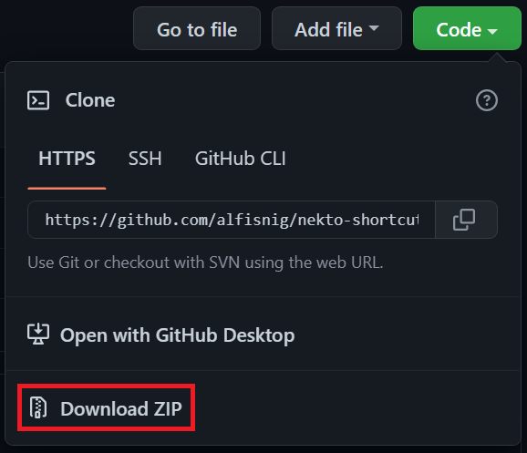
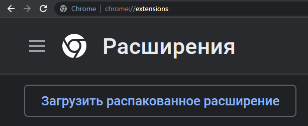
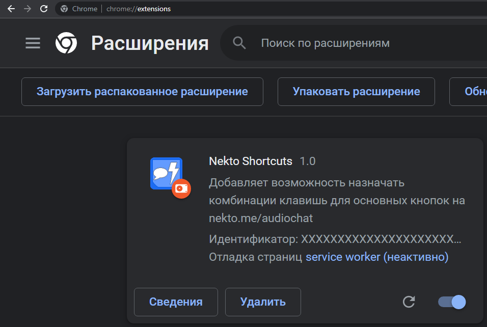
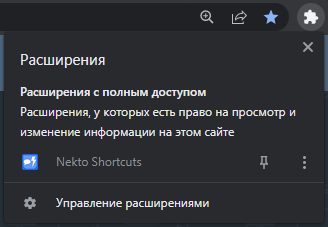
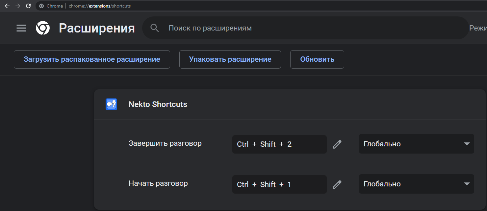

# Nekto Shortcuts (google extension)
  
Данное расширение добавляет возможность назначать комбинации клавишь для основных кнопок на nekto.me/audiochat.
  
## Установка расширения (его нет в google магазине)
1. Нужно скачать репозиторий .zip архивом. 
2. Распаковать архив с папкой, перейти во вкладку с расширениями браузера (chrome://extensions/) и "Загрузить распакованное расширение".  
3. В итоге Nekto Shortcuts появится в списке расширений. 
## Функционал расширения
Во вкладке с комбинациями клавишь установленных расширений (chrome://extensions/shortcuts) можно настроить комбинации клавишь для Nekto Shortcuts, а также выбрать будут ли они работать глобально (даже когда браузер свёрнут и открыто другое приложение) или же только когда браузер находится в фокусе. 
 
> **Расширение работает только когда активна (открыта) вкладка с сайтом nekto.me/audiochat**
